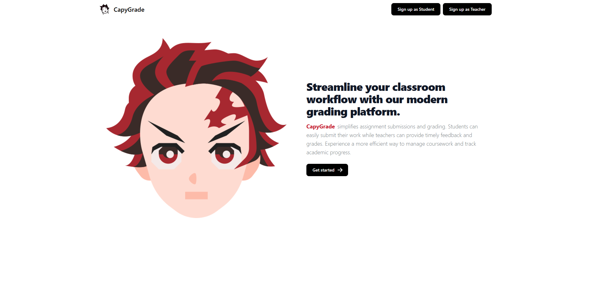
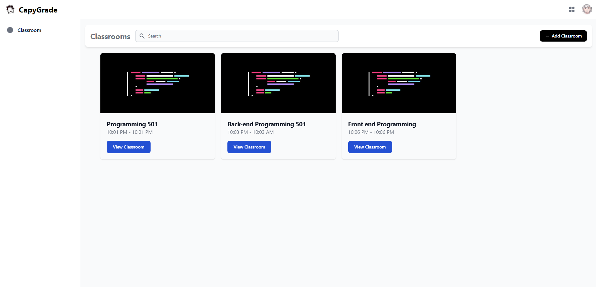
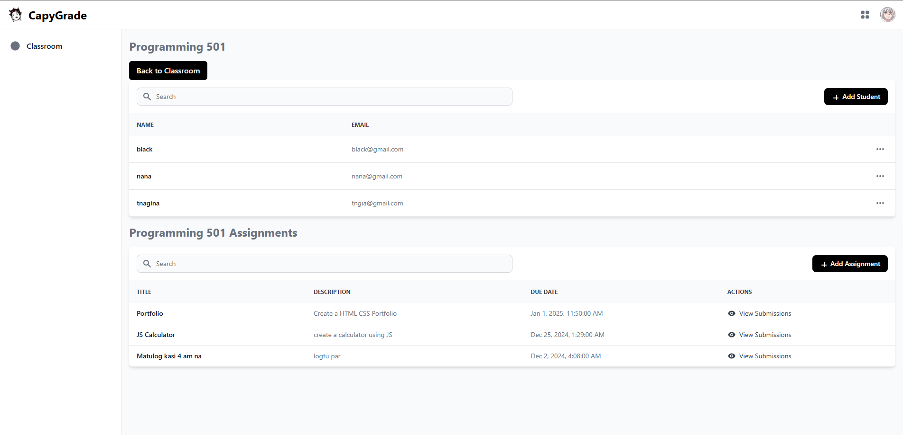
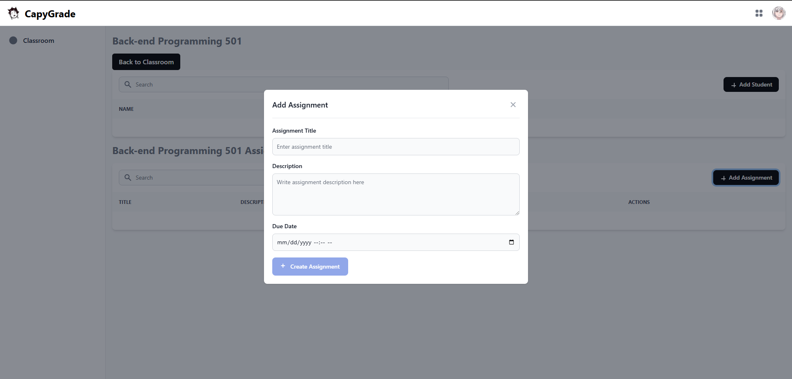
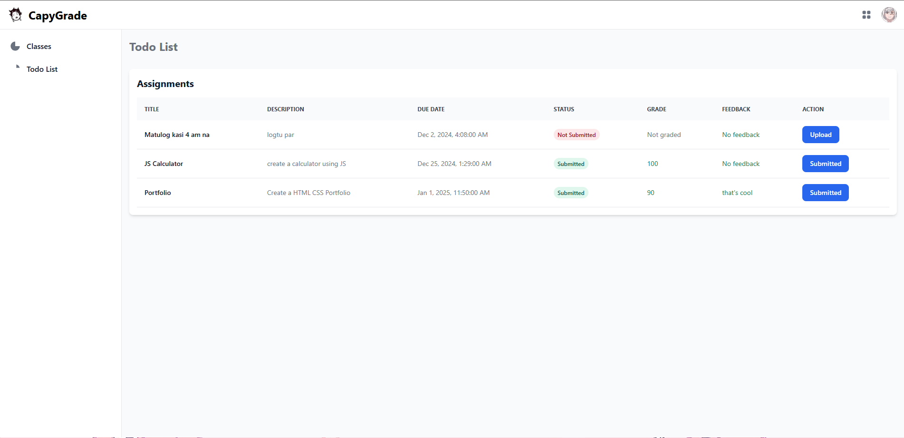

## License
This project is licensed under the MIT License. See the [LICENSE](LICENSE) file for details.
---

# **CapyGrade**

**CapyGrade** is a Learning Management System (LMS) designed to streamline classroom workflows, simplify assignment submissions, and enhance grading efficiency. This project was built with **Angular 18.1.2** and features various interfaces tailored for teachers and students.

---

## **Table of Contents**

1. [Overview](#overview)
2. [Screenshots](#screenshots)
    - [Landing Page](#landing-page)
    - [Teacher Dashboard](#teacher-dashboard)
    - [Classroom View](#classroom-view)
    - [Add Assignment](#add-assignment)
    - [Student Dashboard](#student-dashboard)
    - [Todo List](#todo-list)
3. [Getting Started](#getting-started)
4. [Development](#development)
5. [Testing](#testing)
6. [Build and Deployment](#build-and-deployment)
7. [Further Help](#further-help)

---

## **Overview**

CapyGrade provides a seamless platform for educators and students to interact. Educators can manage classrooms, assignments, and grading, while students can track their progress, manage tasks, and access resources efficiently.

---

## **Screenshots**

### **Landing Page**


### **Teacher Dashboard**


### **Classroom View**


### **Add Assignment**


### **Student Dashboard**


### **Todo List**


---

## **Getting Started**

### **Prerequisites**
- [Node.js](https://nodejs.org) (v18 or above)
- [Angular CLI](https://angular.io/cli) (v18.1.2)

### **Installation**
1. Clone the repository:
   ```bash
   git clone https://github.com/your-username/capygrade.git
   cd capygrade
   ```
2. Install dependencies:
   ```bash
   npm install
   ```

---

## **Development**

### **Start the Server**
Run the following command to start the development server:
```bash
ng serve
```
Navigate to [http://localhost:4200/](http://localhost:4200/) to view the app.

### **Code Scaffolding**
Generate new components, directives, or services using Angular CLI:
```bash
ng generate component component-name
```

---

## **Testing**

### **Unit Tests**
Execute unit tests using [Karma](https://karma-runner.github.io):
```bash
ng test
```

### **End-to-End Tests**
Run end-to-end tests (requires an e2e package):
```bash
ng e2e
```

---

## **Build and Deployment**

### **Build the Project**
To build the project for production, run:
```bash
ng build --prod
```
The build artifacts will be stored in the `dist/` directory.

---

## **Further Help**

For more information about the Angular CLI, refer to the [Angular CLI Documentation](https://angular.io/cli).

---

## **Contributing**

If you'd like to contribute to CapyGrade:
1. Fork the repository.
2. Create a feature branch: `git checkout -b feature-name`.
3. Commit your changes: `git commit -m 'Add feature'`.
4. Push to the branch: `git push origin feature-name`.
5. Open a pull request.

---

